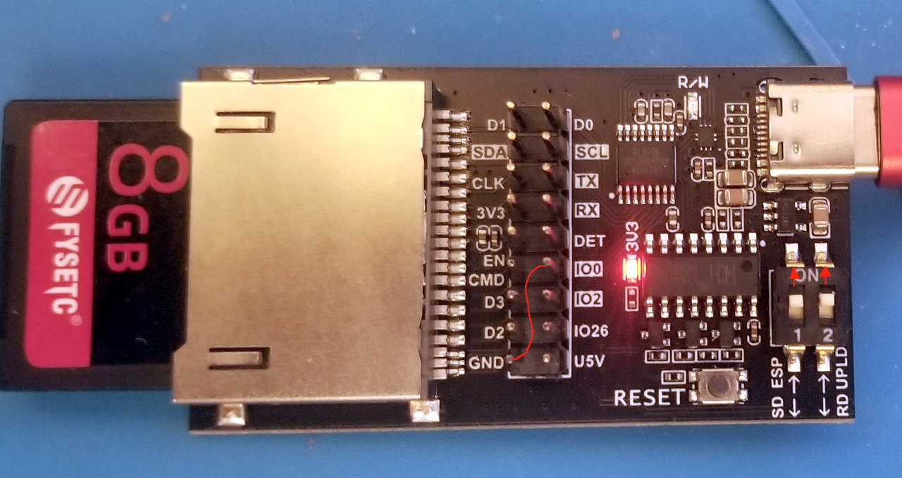
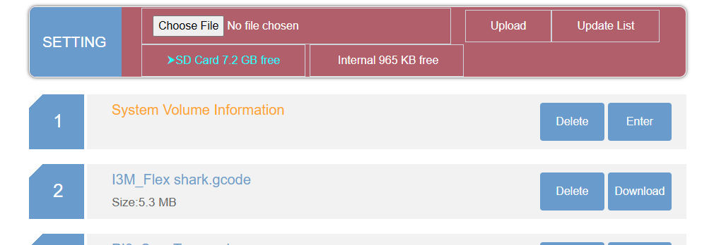

This is frimware of SD WIFI PRO(SWP)

### Flash Binary firmware to SD WIFI PRO(SWP)
Binary firmware have put into "tools\Flash\binary" directory.

1. Let SD WIFI PRO and SD WIFI PRO dev board to work together
Insert SD WIFI PRO into dev board socket, let USB cable inset to USB 
Type-C connector, and plug the cable to PC USB port.
Let the DIP is on right status: switch 1 is at OFF status, switch 2 is 
at ON status. 
If SD WIFI PRO and dev board are OK, "USB-SERIASL CH340(COMX)" will show
at Ports COM & LPT in Device Manager in Windows 10.

2. Flash
There is a batch script named install-all-8M.bat at "tools\Flash\" 
directory.  
Using the script to flash firmware bin to SD WIFI PRO at Command Prompt 
in windows operations system.

## SWD 0.x

### Access SD WIFI PRO(SWP) 
After power up, SD WIFI PRO will create a wireless access points, the AP 
ssid named as "SD-WIFI-PRO-RD".
Let device,such as PC and mobile, connect wirelessly to SD-WIFI-PRO-RD, 
after success, you can access the SD WIFI PRO by web browser.
The default AP local ip is 192.168.4.1, so usging "http://192.168.4.1" 
the Web address to asscess to SD WIFI PRO.

### Functions
1. List and Upload files
After acccess to SD WIFI PRO by http://192.168.4.1, now SWD show file list 
page at brownse.
The page list all the files in the SD card of SD WIFI PRO(8GB high-spped 
memory).

At the top block of the page , select a file , click "Upload" button to 
upload file to SD WIFI PRO.

Click "SETTING" in the left on the top block of the page, will show 
wifi.htm page.

2. Setting
Config SD WIFI PRO WiFi at wifi.htm page.

Input the right network ssid and password ,click the "Connect" button can 
let the SD WIFI PRO connect to a WiFi network.
Click "Go to AP mode", can change SD WIFI PRO into AP mode.
  
### Building  
The 0.x release use Arduino to compile.  
    
Note:the SD WIFI PRO use AsyncTCP and ESPAsyncWebServer.  
AsyncTCP: https://github.com/ESP32Async/AsyncTCP  (newer version)  
ESPAsyncWebServer: https://github.com/ESP32Async/ESPAsyncWebServer (newer version)  
  
### Additional notes (CuriousTech):  
How to flash: Set both switches in the ON position, and jumper IO0 to GND, then plug it in or reset, then remove the jumper.  
  
For building, I used Arduino IDE, and ESP32 2.0.14, board is ESP32-PICO-D4 and default partition  
Changes in this fork:  
SETUP.INI is read from the SDCard, then internal SPIFFS, then Prefs when those fail  
Filenames with spaces can be deleted and downloaded  
Added ArduinoOTA for updates  
WiFi SSID scan in wifi page  
Added EspTouch support (now disabled because it overrides AP mode). It can be enabled by uncommenting the beginConfig() line in network.cpp  
Changed a lot of interactions to WebSocket I/O, added disk free space to main page  
Added directory capability on SD card and internal. Internal must be changed to FFat to write and use directories.  This can be done by changing the 2 lines in FSWebServer.h but remember to upload data as FatFS using the ESP32 Sketch Data Upload Tool.  
  
  
